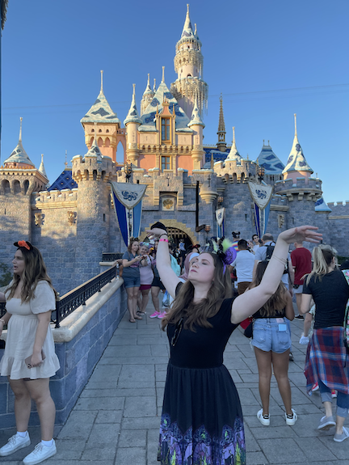

# My First Coding Assignment

## About Me
I am in my second year of my Master of Mass Communications program. I enjoy my family's annual trip to Disney World, exploring new places and trying new things, watching movies and live theatre, reading, playing with animals, and spending time with my husband.
## Past Coding Experience
I have no past coding experience beyond adjusting HTML text in the source code of content blocks in a CMS like Wordpress or Cascade.
## Career Goals
1. Expand my marketable skills through my master's program.
2. Boost my resume through additional career opportunities.
3. One day run the marketing and communications team for a non-profit organization working for a cause I am passionate about.